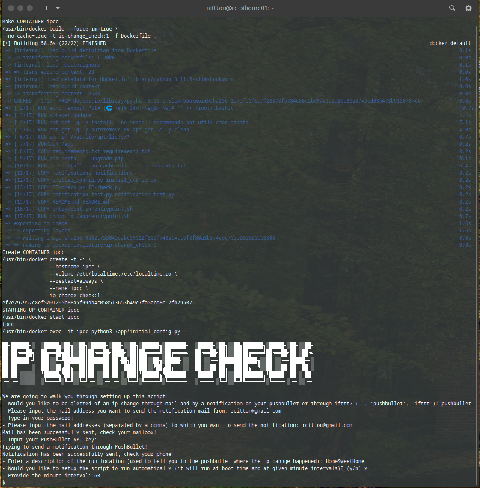

# Public IP change check
Simple module meant to notify user if public IP change has occured.

## What it does
I use this to check for changes on my server which has a dynamic public IP

This writes the current public ipv4 address in a text file (defaults to ~/.config/ip-changed/ip.log) and checks against that every hour by default.
If it changes it will put a line in the file describing when and what the change was and updates the current ip.
It also notifies you of this change via mail and pushbullet or ifttt.

## dependencies

* python 3
* python-crontab
* keyring
* keyrings.alt
* pushbullet.py
* python-magic
* requests

(see requirements.txt)

## Tested on

* Ubuntu 23.04
* Raspberry PI 4 arm64 (with Docker)

## Installation

Install pushbullet.py, issuing:

    ./start.sh

Once the requirements are installed, `initial_config.py` will be executed. 

At this time you will have a new entry in user crontab as following:

     */60 * * * * <path>/ip-change_check/IP-check.py >> <HOME>/.config/ip-changed/ip-changed.log 2><HOME>/.config/ip-changed/ip-changed.err # ipchange_checker

## Removal

Following command will disable the `ipchange_checker` user contab entry

    ./remove.sh

## Test Notification setup
You may test your OutageDetector notification setup issuing the command:

```
python3 ./notifications_test.py
```

## Change the configuration
Run again:

```
python3 ./initial_config.py
```

## Environment Variables

Use OS or Docker environmet variables to configure the program run.

| Variable                | Default Value        | Informations                                                 |
|:------------------------|:---------------------|:-------------------------------------------------------------|
| NOTIFICATION_TYPE       |                      | Notification type: none, ifttt, pushbullet|
| SENDER_MAIL_ADDRESS     |                      | Sender mail address|
| RECEIVER_MAIL_ADDRESSES |                      | Receiver mail address|
| SMTP_SERVER             |                      | SMTP Server address|
| SMTP_SERVER_PORT        |                      | SMTP Server Port|
| MAIL_PASSWORD           |                      | SMTP Mail password
| IFTTT_NAME              |                      | IFTTT Name|
| NOTIFICATION_PASSWORD   |                      | Notification token/password |
| OUTAGE_CHECK            |         60           | Outage check interval  (min)|
| HOUSE_ADDRESS           |                      | Description of the run location|
| CRONTAB                 |        False         | Il will make the crontab entry|


## Installation using Docker/Podman

A Makefile is available to facilitate the setup/maintenance process. An example of setup workflow is as following:


### Initial Setup

Run following command to setup the docker/podman 'ipcc' container:

    make all

`make all` will execute following make command in sequence:

* 'make build' --> It will make the `ip-change_check` 
* 'make create'--> It will create `ipcc` container
* 'make start' --> It will start `ipcc` container
* 'make setup' --> It will setup the ip-change-check

### Start & Stop

The container `ipcc` cna be started and stopped issuing

    make start
    make stop

### Connect

You can go inside `ipcc` container issuing:

    make connect

### Notification check

Notification setup can be tested running:

    make test

### Setup change

You may reconfigure `ipcc` container issuing:

    make setup

### Clean

Docker/Podman IP change check image and container can be cleaned up issuing

    make clean

Pay attention as both the image and the container will be removed

## Switch from Docker to Podman

If you need setup IP change check on Podman, edit the Makefile at line 40 and cahnge the line from

    RUNTIMECT=$(DOCKER)

to

    RUNTIMECT=$(PODMAN)


## How to setup GMail

GMail two factor authentification is not supported. You need to define an App password.

Important: To create an app password, you need 2-Step Verification on your Google Account.

Create & use app passwords:

    Go to your Google Account.
    Select Security
    Under "Signing in to Google," select 2-Step Verification.
    At the bottom of the page, select App passwords.
    Enter a name that helps you remember where you’ll use the app password.
    Select Generate.
    To enter the app password, follow the instructions on your screen. The app password is the 16-character code that generates on your device.
    Select Done.

The generated token is your 'NOTIFICATION_PASSWORD'.


## How to setup IFTTT

Install the IFTTT app and either create an account or sign in to an existing account and create a new applet. 

Next, select the 'add' button beside the word 'If This' and choose the Webhooks service. Select 'Recieve a web request', choose an event name (i.e.' IPChange_check') — you will need to remember this for 'IFTTT_NAME'. Select 'Create trigger' button

Select the 'add' button beside the word 'Then That' and choose any action that you like. For example 'Notifications'.
Clear everything from the message text box and choose Value1 from the Insert Ingredients menu. Enter any necessary information and press 'Create action'.

Select 'Continue' an 'Finish'

Select the Webhooks icon in the top left of the screen and press the 'Documentation' button (in a web browser). This will give you a key which you will need for 'NOTIFICATION_PASSWORD'.


## How to setup PushBullet
See details at https://www.pushbullet.com/

